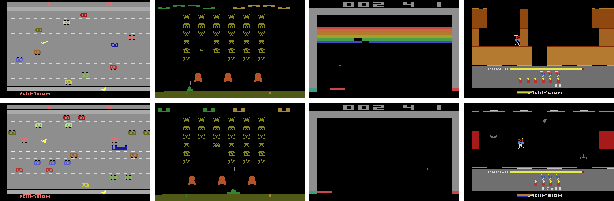

# DQN for the Arcade Learning Environment (ALE)
**Implementation of DQN for the Arcade Learning Environment adhering to the latest methodologies for doing RL on the ALE. This code was used in our paper _[Generalization and Regularization in DQN](https://arxiv.org/abs/1810.00123)_ .**

## Why?

You can find dozens of implementations of DQN online... Why another?

1) When iterating on DQN or any deep reinforcement learning algorithms a lot of the time the evaluation phase is tightly coupled with the algorithm itself. This can make it hard to jump in and modify what you need
2) Plenty of implementations haven't been tested on large scale experiments
3) Some implementations have fragmented evaluation protocols (e.g., episode termination, summarizing performance, stochasticity)

_Most importantly_ this implementation adheres to all new evaluation methodologies outlined in the paper by Machado et al., titled _"Revising the Arcade Learning Environment: Evaluation Protocols and Open Problems for General Agents"_ [[1](https://arxiv.org/abs/1709.06009)].

This code was also used to generate results for the paper _"Generalization and Regularization in DQN"_ [[2](https://arxiv.org/abs/1810.00123)]. Note that this repository has since been cleaned up to support deprecations in TensorFlow. More information on reproducing the results from our paper can be found at [JesseFarebro/dqn-generalization](https://github.com/JesseFarebro/dqn-generalization).

If you don't need something that's easy to hack on I would highly recommend using the [Dopamine](https://github.com/google/dopamine) framework.

## Key Changes in Methodology

* Use sticky actions by default (p = 0.25)
* Don't use loss of life as a terminal signal
* Evaluate performance over the last `n` (`n = 100` usually) episodes, no distinct evaluation scheme during training
* _Do not_ use the max over the learning curve to report performance

## Usage
I use [Poetry](https://poetry.eustace.io/) to manage dependencies and virtual environments. It will make your life easier to download and install Poetry.

1) Clone the repository with submodules.
2) Build the [Arcade Learning Environment](https://github.com/mgbellemare/Arcade-Learning-Environment) in the submodule. Instructions can be found in the repo.
3) `poetry install` to install dependencies.
4) `poetry shell` to launch a shell where you can run `main.py` and explore the hyperparameters in `config.py`.

Note: if you are using a GPU you'll want to specify `poetry install -E tensorflow-gpu` in step 3 to switch to using TensorFlow with GPU support.

## Configuration
There are many hyperparameters in deep RL. Sometimes it can be a little daunting. We adhere to most hyperparameters outlined in [[1](https://arxiv.org/abs/1709.06009)].

More in depth documentation for each hyperparameter can be found in [docs/config.md](https://github.com/JesseFarebro/dqn-ale/blob/master/docs/config.md).

## References

[1] [Machado et al., Revisiting the Arcade Learning Environment: Evaluation Protocols and Open Problems for General Agents](https://arxiv.org/abs/1709.06009)

[2] [Farebrother et al., Generalization and Regularization in DQN](https://arxiv.org/abs/1810.00123)
